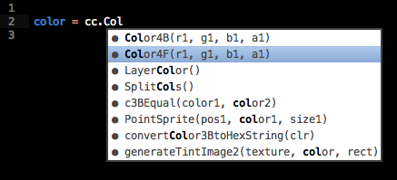

# cocos2d-coffee-autocomplete

Provide autocompletion for cocos2d-x/html5 projects written in CoffeeScript

This scripts fetches documentation from cocos2d-x website and transforms it into valid CoffeeScript files that allow developers to use autocompletion when writing cocos2d-x/html5 applications with CoffeeScript. The generated files have been tested with Sublime Text 2 + SublimeCSAutocompletePlus plugin (https://github.com/justinmahar/SublimeCSAutocompletePlus).

For convenience, already generated coffee files are available in ``output`` folder and the used documentation in ``docs`` folder.



## Installation

### Installing cocos2d-coffee-autocomplete

``` bash
$ npm install cocos2d-coffee-autocomplete
```

## Usage

In node repository,

``` bash
$ node ./index.js
```

## License 

(The MIT License)

Copyright (c) 2013 Jérémy Faivre &lt;contact@jeremyfa.com&gt;

Permission is hereby granted, free of charge, to any person obtaining
a copy of this software and associated documentation files (the
'Software'), to deal in the Software without restriction, including
without limitation the rights to use, copy, modify, merge, publish,
distribute, sublicense, and/or sell copies of the Software, and to
permit persons to whom the Software is furnished to do so, subject to
the following conditions:

The above copyright notice and this permission notice shall be
included in all copies or substantial portions of the Software.

THE SOFTWARE IS PROVIDED 'AS IS', WITHOUT WARRANTY OF ANY KIND,
EXPRESS OR IMPLIED, INCLUDING BUT NOT LIMITED TO THE WARRANTIES OF
MERCHANTABILITY, FITNESS FOR A PARTICULAR PURPOSE AND NONINFRINGEMENT.
IN NO EVENT SHALL THE AUTHORS OR COPYRIGHT HOLDERS BE LIABLE FOR ANY
CLAIM, DAMAGES OR OTHER LIABILITY, WHETHER IN AN ACTION OF CONTRACT,
TORT OR OTHERWISE, ARISING FROM, OUT OF OR IN CONNECTION WITH THE
SOFTWARE OR THE USE OR OTHER DEALINGS IN THE SOFTWARE.